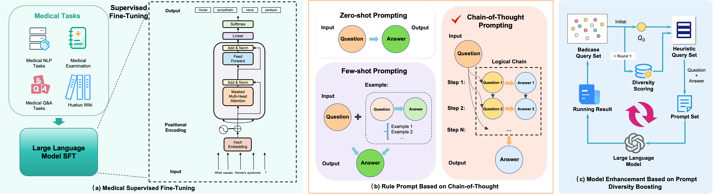

# domain-enhanced-llm-emr-qc


This project implements A Systematic Approach for Leveraging Domain Knowledge Enhanced Large Language Models for Quality Control of Electronic Medical Records.

## Overview

The quality of Electronic Medical Records (EMRs) is crucial for healthcare systems. This project aims to develop an innovative method to improve the efficiency and accuracy of EMR quality control by combining medical domain knowledge with advanced large language model technology.We open source Medical Supervised Fine-Tuning module.



The Medical Supervised Fine-Tuning module, combines medical data to inject medical knowledge into the large language model, so that the large language model has a strong effect in the medical field.

## install

```
https://github.com/linghs/domain-enhanced-llm-emr-qc.git
cd domain-enhanced-llm-emr-qc
pip install -r requirements.txt
```

## run train
```
sh run_main.sh
```
